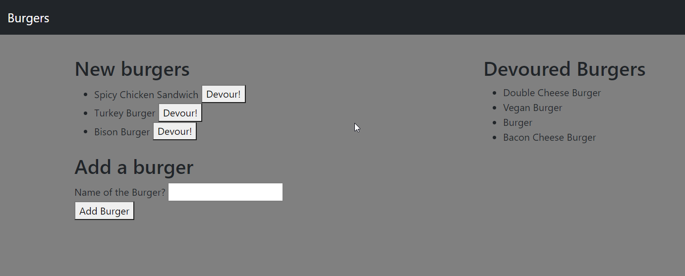
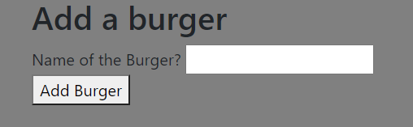
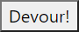

# Burger-Logger

This project was designed as a homework assignment for MSU's coding bootcamp. 

This application was created with the use of Javascript, Node.js, mysql, express, handlebars, html, and css (w/bootstrap). It has an MVC style directory as well as using JawsDB as the server.

This projects' code can be found on my github (Link can be found below).

# Table of Contents
1. [Links](#Links)
2. [Project Overview](#projectoverview)
3. [Execution](#Execution)
4. [Contains](#Contains)
5. [Demonstration](#Demonstration)
6. [Future](#Future)

## Links

* [GitHub Repository](https://github.com/CMarcano7/Burger-Logger)
* [Heroku](https://aqueous-earth-13566.herokuapp.com/)

## Project Overview 

* This project was made so that the user could make a list of burgers they would like to eat and "devour" them as they do.

## Execution
### Use the Github Link above:
> First go to the Heroku link above.
> Next you can add burgers with the text input field.

> After you can also "devour" a burger hitting the button right next to it.

## Contains: 
* Config dir
    * connection.js
    * orm.js

* db dir
  * schema.sql
  * seed.sql

* models dir
  * burger.js

* views dir
  * index.handlebars
  * layouts dir
    * main.handlebars
  * partials\burgers dir
    * devoured_burger_block.handlebars
    * new_burgers_block.handlebars

* controllers dir
  * burgers_Controller.js

* public\assets dir
  * css dir
    * style.css
  * js dir
    * burgers.js

* Express
    * [Express](https://expressjs.com/en/5x/api.html)

* Handlebars
    * [Handlebars](https://handlebarsjs.com/guide/)

* Jawsdb
    * [Jawsdb](https://www.jawsdb.com/docs/)

* mysql
    * [mysql](https://www.npmjs.com/package/mysql)

* Find node.js docs [Here](https://nodejs.org/dist/latest-v14.x/docs/api/)

## Demonstration

* Link to demo [Here](https://drive.google.com/file/d/1fN2H5C6MkdYvfceS9f6e0rKMwBTHDKCU/view).
* MSU BootCamp

## Future

* For the future of this project I would like to create a feature so that the user can rate the burgers and place where they got them from so that other users are able to see.